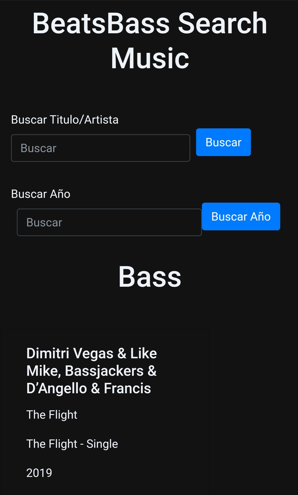

# Biblioteca Musical Nodejs/Express

Lee datos de un archivo txt, para luego guardarlos en
Mongodb.

En la interfaz puede buscar por artista/título de la música, así como el año.

Para iniciar cargar datos al archivo txt, como se muestra 
en el archivo txt de prueba. Luego crear un archivo .env
,dentro del archivo escribir "URI = tu_direccion_para_conectar_MongoDb"

Por último en consola escribir npm i, y luego npm start.

Y listo ya creaste tu propia Biblioteca Musical.

Live : https://musica8.herokuapp.com
